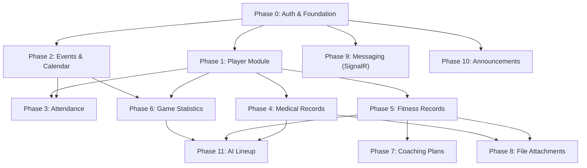

# Equipex — Full Implementation Plan & Task Breakdown

> Consolidated from 49 verified answers + 6 decision points. This is the master reference for all remaining development.

---

## Authority Matrix (Final)

> [!IMPORTANT]
> **R** = Read, **W** = Write (Create/Edit/Delete), **—** = No Access. All access is **team-scoped** unless noted.

| Data Domain | Admin | Manager | BasketballCoach | FitnessCoach | Doctor (Medic) | Analyst | Player |
|---|---|---|---|---|---|---|---|
| **User Accounts** | W (any role) | W (any role except Manager) | — | — | — | — | — |
| **Teams** | W (any team) | W (own teams) | — | — | — | — | — |
| **Team Members** | W (add/remove/role) | W (add/remove/role, own teams) | — | — | — | — | — |
| **Player Profile** | W | W (own teams) | — | W (own teams) | — | — | R (own only) |
| **Events/Calendar** | W (any team) | W (own teams) | R | R | R | R | R (own team) |
| **Attendance** | W (any team) | W (own teams) | — | — | — | — | R (own) |
| **Medical Records** | R | R (own teams) | R (own team) | R (own team) | W (own team) | R (own team) | R (own only) |
| **Fitness Records** | R | R (own teams) | R (own team) | W (own team) | R (own team) | R (own team) | R (own only) |
| **Game Stats** | R | R (own teams) | R (own team) | R (own team) | — | W (own team) | R (own + team agg.) |
| **Cumulative Stats** | R | R (own teams) | R (own team) | R (own team) | — | R (own team) | R (own + team agg.) |
| **Coaching Plans** | R | R (own teams) | W (own plans) | W (own plans) | — | R (own team) | R (assigned to team) |
| **AI Lineup** | R | R (own teams) | W (view/assign/create) | — | — | — | — |
| **Messages** | — | — | W (own convos) | W (own convos) | W (own convos) | W (own convos) | W (own convos) |
| **Announcements** | W (any team) | W (own teams) | R | R | R | R | R |
| **File Uploads** | W | W | W (own) | W (own) | W (own) | W (own) | W (medical docs) |
| **Clearance (is_cleared)** | — | — | — | — | W (toggle) | — | R (own) |

### Special Rules
- **Player**: single team only; removed from old team on join request acceptance
- **Other roles** (Coach, FitnessCoach, Medic, Analyst): can be on multiple teams simultaneously
- **Manager**: can manage multiple teams; teams can have multiple managers
- **Attendance**: only Manager/Admin records attendance; they see injury Boolean from Doctor
- **Events**: only Manager/Admin creates/edits events
- **Medical doc workflow**: Doctor requests → Player uploads → auto-creates "Pending" record → Doctor approves

---

## Architecture Decision: Recurring Events

**Recommendation**: Use **RRULE + Instance Generation** pattern.
- Store a `recurrence_rule` column on the `event` table (nullable, only for Training Sessions)
- Generate event instances on-the-fly when querying a date range (don't pre-create all instances)
- Store exceptions in an `event_exception` table (`original_date`, `new_date` or `is_cancelled`)
- This is the same pattern Google Calendar uses — lightweight, flexible, no season-length pre-creation

---

## Phase Breakdown (Priority Order)

### Phase 0 — Auth & Foundation Fixes
> Complete remaining gaps in the existing Auth service

| # | Task | Details | Effort |
|---|---|---|---|
| 0.1 | **Multi-manager support for teams** | Change `Team.ManagerUserId` to a `team_manager` junction table (M:N). Update TeamService, TeamController, and RLS policies. | M |
| 0.2 | **Remove member from team endpoint** | `DELETE /teams/{teamId}/members/{userId}` — removes UserRole for that team. For Players, also sets `player_team.left_date`. | S |
| 0.3 | **Add user to team (post-approval)** | `POST /teams/{teamId}/members` — Manager adds an already-approved user to their team with a role. | S |
| 0.4 | **Role change restrictions** | Manager cannot assign Manager role. Validate in `UpdateMemberInfoAsync`. | S |
| 0.5 | **Team join request pipeline** | New `TeamJoinRequest` entity + endpoints. Player submits join request → target Manager approves → auto-remove from old team (Player only). Other roles: just add to team. | L |
| 0.6 | **Filter pending approvals** | Decide: show all pending, or filter per Manager. Recommend: show all (Manager picks and assigns to their team during approval). | S |

---

### Phase 1 — Player Module
> Player self-service: profile, stats, schedule, medical docs

| # | Task | Details | Effort |
|---|---|---|---|
| 1.1 | **PlayerProfile entity + EF config** | Map existing `player_profile` DB table. Fields: position, jersey_number, height, weight, dominant_hand. | S |
| 1.2 | **PlayerTeam entity + EF config** | Map `player_team` DB table. Enforce single-team constraint. | S |
| 1.3 | **PlayerController endpoints** | `GET /player/me/profile`, `GET /player/me/stats`, `GET /player/me/fitness`, `GET /player/me/medical`, `GET /player/me/schedule`. All read-only, own data only. | M |
| 1.4 | **Player team roster view** | `GET /player/me/team/roster` — list all players + staff on current team. | S |
| 1.5 | **Player team stats view** | `GET /player/me/team/stats` — team aggregate stats only (no individual teammate stats). | S |
| 1.6 | **Player RLS policies** | SQL policies: player can only see own profile, own stats, own medical, own fitness. Team-aggregate stats visible. | M |
| 1.7 | **Manager/FitnessCoach creates player profile** | `POST /teams/{teamId}/players/{userId}/profile` — Manager or FitnessCoach fills in position, jersey, height, weight, hand. Player never fills this. | S |

---

### Phase 2 — Event & Calendar System
> Scheduling for Matches, Meetings, Training Sessions

| # | Task | Details | Effort |
|---|---|---|---|
| 2.1 | **Event entity + EF config** | Map `event` table. Add `recurrence_rule` column (nullable string, RRULE format). | S |
| 2.2 | **EventException entity** | New table: `event_exception(id, event_id, original_date, new_date, is_cancelled, notes)`. | S |
| 2.3 | **EventService** | Create/Edit/Delete events (Manager/Admin only). Expand recurring events into instances for date range queries. Handle exceptions. | L |
| 2.4 | **Match entity + EF config** | Map `match` table. Link to Match-type events. Score, result, opponent. | S |
| 2.5 | **EventController** | `POST /teams/{teamId}/events`, `GET /teams/{teamId}/events?from=&to=`, `PUT /events/{id}`, `DELETE /events/{id}`, `POST /events/{id}/cancel-instance`, `POST /events/{id}/reschedule-instance`. | M |
| 2.6 | **Authorization** | Only Manager/Admin can CUD events. All team members can read. | S |

---

### Phase 3 — Attendance Tracking
> Manager/Admin records attendance at events

| # | Task | Details | Effort |
|---|---|---|---|
| 3.1 | **Attendance entity + EF config** | Map `attendance` table. Status enum: Present, Absent, Late, Injured. | S |
| 3.2 | **AttendanceService** | Record attendance for an event. Bulk update. Show injury status from Doctor's `is_cleared` Boolean. | M |
| 3.3 | **AttendanceController** | `POST /events/{eventId}/attendance`, `GET /events/{eventId}/attendance`, `PUT /events/{eventId}/attendance/{playerId}`. Manager/Admin only for write. | S |

---

### Phase 4 — Medical Records
> Doctor CRUD + Player upload workflow

| # | Task | Details | Effort |
|---|---|---|---|
| 4.1 | **MedicalRecord entity + EF config** | Map `medical_record` table. All fields including `is_cleared`. | S |
| 4.2 | **MedicalDocRequest entity** | New: Doctor requests a document from a Player. Fields: `doctor_staff_id`, `player_id`, `request_type`, `description`, `status` (Pending/Uploaded/Reviewed). | S |
| 4.3 | **MedicalService** | Doctor: create/edit medical records (team-scoped). Toggle `is_cleared`. Review uploaded docs. Player: upload file against a request → auto-creates pending medical_record. | L |
| 4.4 | **MedicalController** | `POST /teams/{teamId}/medical`, `GET /teams/{teamId}/medical`, `PUT /medical/{id}`, `PATCH /medical/{id}/clearance`. Player endpoints: `GET /player/me/medical`, `POST /player/me/medical/{requestId}/upload`. | M |
| 4.5 | **Data visibility** | All team members can view medical records of their team. Players can only see their own. Doctor is the only one with write access. | S |

---

### Phase 5 — Fitness Records
> FitnessCoach CRUD + Player read-only

| # | Task | Details | Effort |
|---|---|---|---|
| 5.1 | **FitnessRecord entity + EF config** | Map `fitness_record` table. | S |
| 5.2 | **FitnessService** | FitnessCoach: full CRUD (team-scoped). Others: read-only (team-scoped). Player: own records only. | M |
| 5.3 | **FitnessController** | `POST /teams/{teamId}/fitness`, `GET /teams/{teamId}/fitness`, `PUT /fitness/{id}`, `DELETE /fitness/{id}`. | S |

---

### Phase 6 — Game Statistics & Analytics
> Analyst inputs stats, everyone reads

| # | Task | Details | Effort |
|---|---|---|---|
| 6.1 | **PlayerGameStats + TeamGameStats entities** | Map both tables with all CHECK constraints. | S |
| 6.2 | **StatsImportService** | Analyst uploads PDF/Excel → parse and extract stats data. Also manual entry option. | L |
| 6.3 | **StatsService** | CRUD for game stats (Analyst only, team-scoped). Trigger materialized view refresh. | M |
| 6.4 | **AnalyticsService** | Query materialized views. Player cumulative, team cumulative. | S |
| 6.5 | **StatsController + AnalyticsController** | `POST /teams/{teamId}/matches/{matchId}/stats`, `POST /teams/{teamId}/stats/import`, `GET /teams/{teamId}/analytics`. | M |
| 6.6 | **Player stat visibility** | Player sees: own individual stats + team aggregates. Cannot see teammate individual stats. | S |

---

### Phase 7 — Coaching Plans
> Coach/FitnessCoach create plans, team can view

| # | Task | Details | Effort |
|---|---|---|---|
| 7.1 | **CoachingPlan + TrainingSession entities** | Map tables. | S |
| 7.2 | **CoachingService** | Coach/FitnessCoach: create private plans + team-visible plans. Others: read team-visible plans only. | M |
| 7.3 | **CoachingController** | `POST /teams/{teamId}/plans`, `GET /teams/{teamId}/plans`, `PUT /plans/{id}`, `DELETE /plans/{id}`. | S |
| 7.4 | **Update RLS** | Coach sees own private plans + team plans. Team members see team plans only. | S |

---

### Phase 8 — File Attachments & Cloud Storage
> Unified file upload/download service

| # | Task | Details | Effort |
|---|---|---|---|
| 8.1 | **FileAttachment entity** | Map `file_attachment` table with `file_entity_type` enum. | S |
| 8.2 | **Cloud storage integration** | Use Azure Blob Storage or AWS S3. Upload/download with signed URLs. | M |
| 8.3 | **FileController** | `POST /files/upload`, `GET /files/{id}/download`. Link to medical records, fitness records, coaching plans, stats. | M |

---

### Phase 9 — Messaging (Real-time, SignalR)
> WhatsApp-style real-time messaging

| # | Task | Details | Effort |
|---|---|---|---|
| 9.1 | **Conversation + Message entities** | Map `conversation`, `conversation_participant`, `message`, `message_read`. | S |
| 9.2 | **SignalR Hub** | `ChatHub` with real-time message delivery, typing indicators, read receipts. | L |
| 9.3 | **MessagingService** | Create conversations (1:1 or group), send messages, mark read, soft-delete. | M |
| 9.4 | **MessagingController** | REST fallback: `POST /conversations`, `GET /conversations`, `GET /conversations/{id}/messages`. | M |

---

### Phase 10 — Announcements
> Manager/Admin posts team-wide announcements

| # | Task | Details | Effort |
|---|---|---|---|
| 10.1 | **Announcement + AnnouncementRead entities** | Map tables. | S |
| 10.2 | **AnnouncementService** | Create/edit/delete (Manager/Admin). Mark read per user. | S |
| 10.3 | **AnnouncementController** | `POST /teams/{teamId}/announcements`, `GET /teams/{teamId}/announcements`. | S |

---

### Phase 11 — AI Lineup Suggestions
> Coach-only feature for lineup optimization

| # | Task | Details | Effort |
|---|---|---|---|
| 11.1 | **AiLineupSuggestion + LineupPlayer entities** | Map tables. | S |
| 11.2 | **LineupService** | Coach: create manual lineups, request AI suggestions, view results. Pull from stats + fitness + medical clearance. | L |
| 11.3 | **LineupController** | `POST /teams/{teamId}/lineup/suggest`, `POST /teams/{teamId}/lineup`, `GET /teams/{teamId}/lineup`. Coach-only access. | M |

---

### Phase 12 — Cross-Cutting Concerns

| # | Task | Details | Effort |
|---|---|---|---|
| 12.1 | Structured logging (Serilog) | — | S |
| 12.2 | Rate limiting (auth endpoints) | — | S |
| 12.3 | CORS for frontend | — | S |
| 12.4 | Docker + docker-compose | API + PostgreSQL + Redis (for SignalR backplane) | M |
| 12.5 | Swagger with auth headers | — | S |
| 12.6 | CI/CD pipeline | — | M |

---

## Effort Legend
- **S** = Small (< 1 day)
- **M** = Medium (1–2 days)
- **L** = Large (3–5 days)

## Dependency Graph

## Verification Plan

Since this is a **planning document** (no code changes), verification will happen per-phase during implementation. Each phase will include:

### Per-Phase Testing Strategy
1. **Unit tests** for each Service class (mock DbContext)
2. **Integration tests** via Swagger/Postman for each Controller endpoint
3. **Authorization tests** — verify role-based access (attempt access with wrong role → expect 403)
4. **RLS verification** — query DB with different `app.user_id` settings to confirm row isolation
5. **SignalR testing** (Phase 9) — use SignalR client to verify real-time message delivery

### Manual Verification
- For each Phase, we will test the full flow via Swagger UI after implementation
- The user can test the API from a frontend or Postman
