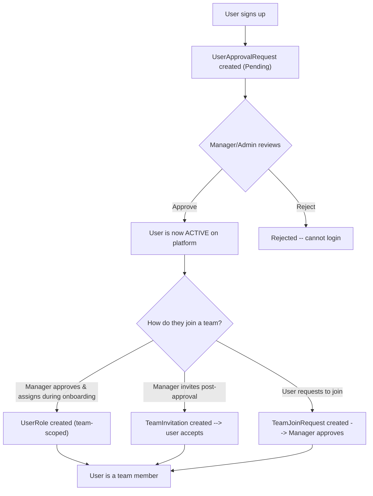
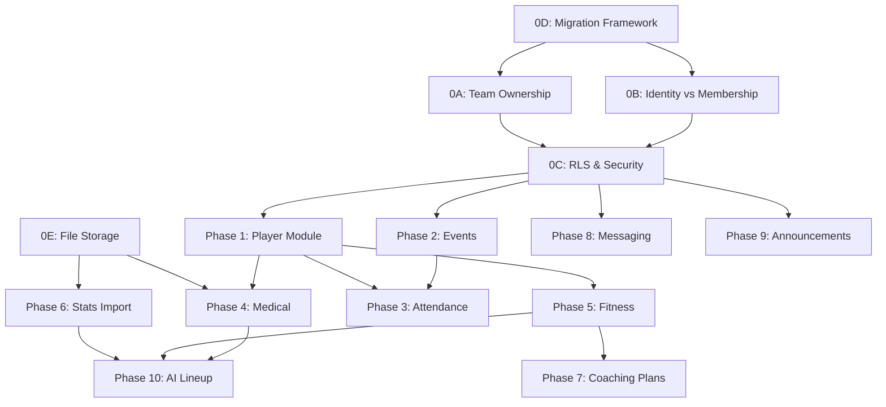

# Equipex -- Implementation Plan v2

> Revised to address all review findings. Changes from v1 marked with **[CHANGED]**.

---

## Authority Matrix (Unchanged from v1)

| Data Domain | Admin | Manager | BasketballCoach | FitnessCoach | Doctor | Analyst | Player |
|---|---|---|---|---|---|---|---|
| User Accounts | W (any role) | W (except Manager) | -- | -- | -- | -- | -- |
| Teams | W (any) | W (own) | -- | -- | -- | -- | -- |
| Team Members | W (add/remove) | W (own teams) | -- | -- | -- | -- | -- |
| Player Profile | W | W (own teams) | -- | W (own teams) | -- | -- | R (own) |
| Events/Calendar | W (any) | W (own teams) | R | R | R | R | R (own team) |
| Attendance | W (any) | W (own teams) | -- | -- | -- | -- | R (own) |
| Medical Records | R | R (own teams) | R (own team) | R (own team) | W (own team) | R (own team) | R (own only) |
| Fitness Records | R | R (own teams) | R (own team) | W (own team) | R (own team) | R (own team) | R (own only) |
| Game Stats | R | R (own teams) | R (own team) | R (own team) | -- | W (own team) | R (own + team agg) |
| Coaching Plans | R | R (own teams) | W (own plans) | W (own plans) | -- | R (own team) | R (team plans) |
| AI Lineup | R | R (own teams) | W (view/create) | -- | -- | -- | -- |
| Messages | -- | -- | W (own) | W (own) | W (own) | W (own) | W (own) |
| Announcements | W (any) | W (own teams) | R | R | R | R | R |
| File Uploads | W | W | W (own) | W (own) | W (own) | W (own) | W (medical docs) |
| Clearance toggle | -- | -- | -- | -- | W | -- | R (own) |

---

## **[CHANGED]** Identity vs. Membership Model

> [!IMPORTANT]
> Three distinct workflows, clearly separated:



| Concept | Entity | Purpose | Who creates | Who approves |
|---|---|---|---|---|
| **Platform Onboarding** | [UserApprovalRequest](file:///C:/Users/Mega%20Store/.gemini/antigravity/scratch/SportsPlatform.Auth/SportsPlatform.Auth.Core/Entities/UserApprovalRequest.cs#5-21) | Admit user to the platform | System (on signup) | Manager/Admin |
| **Team Assignment (onboarding)** | [UserRole](file:///C:/Users/Mega%20Store/.gemini/antigravity/scratch/SportsPlatform.Auth/SportsPlatform.Auth.Core/Entities/UserRole.cs#5-21) (team-scoped) | Assign role + team during approval | Manager/Admin | N/A (immediate) |
| **Team Join Request** | `TeamJoinRequest` [NEW] | User asks to join a specific team | Any active user | Target team's Manager |
| **Manager Invitation** | `TeamInvitation` [NEW] | Manager proactively adds a user | Manager/Admin | Target user accepts |

**Player special rule**: Joining a new team auto-removes from the old team. Other roles can be on multiple teams.

---

## **[CHANGED]** Phase 0 -- Foundation (Split into 5 Epics)

### Epic 0A: Team Ownership Model

> [!WARNING]
> **This touches 8+ files.** `Team.ManagerUserId` is hardcoded in [Team.cs](file:///C:/Users/Mega%20Store/.gemini/antigravity/scratch/SportsPlatform.Auth/SportsPlatform.Auth.Core/Entities/Team.cs), [TeamService.cs](file:///C:/Users/Mega%20Store/.gemini/antigravity/scratch/SportsPlatform.Auth/SportsPlatform.Auth.Core/Interfaces/ITeamService.cs) (6 locations), [ApprovalService.cs](file:///C:/Users/Mega%20Store/.gemini/antigravity/scratch/SportsPlatform.Auth/SportsPlatform.Auth.Core/Interfaces/IApprovalService.cs), and [rls_policies.sql](file:///C:/Users/Mega%20Store/.gemini/antigravity/scratch/SportsPlatform.Auth/scripts/rls_policies.sql).

#### Schema Changes

| Change | Details |
|---|---|
| **New table** `team_manager` | `team_id UUID FK`, `user_id UUID FK`, `assigned_at`, `assigned_by`, PK(`team_id, user_id`) |
| **Drop column** `team.manager_user_id` | After data backfill |
| **Backfill** | `INSERT INTO team_manager SELECT team_id, manager_user_id FROM team WHERE manager_user_id IS NOT NULL` |

#### Code Changes

| File | Change |
|---|---|
| [Team.cs](file:///C:/Users/Mega%20Store/.gemini/antigravity/scratch/SportsPlatform.Auth/SportsPlatform.Auth.Core/Entities/Team.cs) | Remove `ManagerUserId` + `Manager` nav. Add `ICollection<TeamManager> Managers` |
| `TeamManager.cs` [NEW] | New junction entity |
| [TeamService.cs](file:///C:/Users/Mega%20Store/.gemini/antigravity/scratch/SportsPlatform.Auth/SportsPlatform.Auth.Core/Interfaces/ITeamService.cs) | Replace all `t.ManagerUserId == callerUserId` with `_db.TeamManagers.AnyAsync(tm => tm.TeamId == t.TeamId && tm.UserId == callerUserId)`. Extract `IsTeamManagerAsync()` helper. |
| [ApprovalService.cs](file:///C:/Users/Mega%20Store/.gemini/antigravity/scratch/SportsPlatform.Auth/SportsPlatform.Auth.Core/Interfaces/IApprovalService.cs) | Same FK replacement at line 94 |
| [TeamDto.cs](file:///C:/Users/Mega%20Store/.gemini/antigravity/scratch/SportsPlatform.Auth/SportsPlatform.Auth.Core/DTOs/Response/TeamDto.cs) | Replace single `ManagerUserId/ManagerName` with `List<ManagerSummary>` |
| [rls_policies.sql](file:///C:/Users/Mega%20Store/.gemini/antigravity/scratch/SportsPlatform.Auth/scripts/rls_policies.sql) | Replace `manager_user_id = current_app_user_id()` with subquery on `team_manager` |

**Effort: L (3-5 days)** -- migration, backfill, 8+ file refactor, RLS rewrite.

---

### Epic 0B: Identity vs. Membership Separation

Refactor `ApprovalService.ApproveAsync` to cleanly separate concerns:

| Step | Details |
|---|---|
| 1. [ApproveAsync](file:///C:/Users/Mega%20Store/.gemini/antigravity/scratch/SportsPlatform.Auth/SportsPlatform.Auth.Infrastructure/Services/ApprovalService.cs#39-161) only changes `UserApprovalRequest.Status` to Approved | No longer creates [UserRole](file:///C:/Users/Mega%20Store/.gemini/antigravity/scratch/SportsPlatform.Auth/SportsPlatform.Auth.Core/Entities/UserRole.cs#5-21) in the same method |
| 2. New `AssignRoleToTeamAsync(userId, roleName, teamId, assignedBy)` | Standalone method for adding a user to a team -- reusable by approval, invitation, join request |
| 3. New `TeamJoinRequest` entity | `user_id, team_id, requested_role, status (Pending/Approved/Rejected), notes, created_at` |
| 4. New `TeamInvitation` entity | `team_id, invited_user_id, role, invited_by, status (Pending/Accepted/Declined), created_at` |

#### Schema Changes

| Table | Columns | Constraints |
|---|---|---|
| `team_join_request` [NEW] | id, user_id, team_id, requested_role, status, notes, created_at, reviewed_by, reviewed_at | `uq_one_pending_join(user_id, team_id)` |
| `team_invitation` [NEW] | id, team_id, invited_user_id, role, invited_by, status, created_at | `uq_one_pending_invite(team_id, invited_user_id)` |

**Effort: L (3-5 days)** -- new entities, refactored approval flow, new controllers.

---

### Epic 0C: RLS & Security Foundations

> [!CAUTION]
> Current [RlsMiddleware.cs](file:///C:/Users/Mega%20Store/.gemini/antigravity/scratch/SportsPlatform.Auth/SportsPlatform.Auth.Api/Middleware/RlsMiddleware.cs) uses `string.Join(',')` for roles and `app_has_role()` uses substring matching. This breaks when role names overlap (e.g., a role containing "Admin" as a substring).

| Step | Details |
|---|---|
| 1. Change `app.user_roles` to JSON array | `["Admin","Manager"]` instead of `Admin,Manager` |
| 2. Replace `app_has_role()` | New: `SELECT role_name = ANY(string_to_array(current_setting('app.user_roles',true),','))` or JSON parse |
| 3. Create reusable SQL helpers | `is_team_manager(uuid)`, `is_team_member(uuid, uuid)`, `is_admin()` |
| 4. Rebuild all existing policies | Teams + coaching plans using new helpers |
| 5. Test policies | Verify with different role combinations |

#### New SQL Helper Functions

```sql
-- Is the current user a manager of the given team?
CREATE OR REPLACE FUNCTION is_team_manager(p_team_id uuid) RETURNS boolean AS $$
  SELECT EXISTS (
    SELECT 1 FROM team_manager
    WHERE team_id = p_team_id AND user_id = current_app_user_id()
  );
$$ LANGUAGE sql STABLE;

-- Is the current user a member of the given team (any approved role)?
CREATE OR REPLACE FUNCTION is_team_member(p_user_id uuid, p_team_id uuid) RETURNS boolean AS $$
  SELECT EXISTS (
    SELECT 1 FROM user_role
    WHERE user_id = p_user_id AND team_id = p_team_id AND status = 'Approved'
  );
$$ LANGUAGE sql STABLE;

-- Is the current user an admin?
CREATE OR REPLACE FUNCTION is_admin() RETURNS boolean AS $$
  SELECT EXISTS (
    SELECT 1 FROM user_role ur
    JOIN role r ON r.role_id = ur.role_id
    WHERE ur.user_id = current_app_user_id()
      AND r.role_name = 'Admin' AND ur.status = 'Approved'
  );
$$ LANGUAGE sql STABLE;
```

**Effort: M (1-2 days)** -- focused SQL + middleware change.

---

### Epic 0D: Migration Framework

| Step | Details |
|---|---|
| 1. Remove raw SQL from [Program.cs](file:///C:/Users/Mega%20Store/.gemini/antigravity/scratch/SportsPlatform.Auth/SportsPlatform.Auth.Api/Program.cs) (line 93-164) | Replace with proper EF Core migrations or versioned SQL scripts |
| 2. Define ownership | **EF migrations** = entity tables, indexes, constraints. **SQL scripts** = RLS policies, functions, triggers, views, enum changes |
| 3. Use `FluentMigrator` or numbered SQL scripts | Each script prefixed with order number: `001_team_manager_table.sql`, `002_rls_helpers.sql`, etc. |
| 4. Startup runner | Apply pending migrations in order at startup (idempotent) |
| 5. Rollback convention | Each `NNN_up.sql` has a corresponding `NNN_down.sql` |

**Effort: M (1-2 days)**

---

### Epic 0E: File Storage Abstraction **[MOVED EARLIER]**

> Previously Phase 8. Moved here because Medical (Phase 4) and Stats Import (Phase 6) both depend on file upload.

| Step | Details |
|---|---|
| 1. `IFileStorageService` interface | `UploadAsync(Stream, fileName, contentType) -> FileMetadata`, `GetDownloadUrlAsync(fileId) -> string`, `DeleteAsync(fileId)` |
| 2. `S3FileStorageService` impl | AWS S3 with presigned URLs for download |
| 3. `LocalFileStorageService` impl | Fallback for local dev (saves to `wwwroot/uploads/`) |
| 4. `FileAttachment` entity | Map existing `file_attachment` table |
| 5. `FileController` | `POST /files/upload` (multipart), `GET /files/{id}` (redirect to presigned URL) |
| 6. Config toggle | `appsettings.json: "Storage": { "Provider": "S3" | "Local" }` |

#### Schema (Existing Table)
`file_attachment`: id, entity_type, entity_id, file_name, file_path, content_type, size_bytes, uploader_id, created_at

**Effort: M (1-2 days)**

---

## Phase 1 -- Player Module

| # | Task | Effort |
|---|---|---|
| 1.1 | `PlayerProfile` + `PlayerTeam` entities + EF config | S |
| 1.2 | `PlayerController` -- `GET /player/me/profile`, `/stats`, `/fitness`, `/medical`, `/schedule` | M |
| 1.3 | Player team roster view (`GET /player/me/team/roster`) | S |
| 1.4 | Player team stats view (team aggregates only, no teammate individual stats) | S |
| 1.5 | Manager/FitnessCoach creates player profile (`POST /teams/{id}/players/{userId}/profile`) | S |
| 1.6 | Player RLS policies (own data only) using `is_team_member()` helpers | M |

#### Schema (Existing Tables)
- `player_profile`: profile_id, user_id, position, jersey_number, height, weight, dominant_hand
- `player_team`: id, player_id, team_id, joined_date, left_date

---

## Phase 2 -- Events & Calendar

| # | Task | Effort |
|---|---|---|
| 2.1 | `Event` entity + add `recurrence_rule TEXT` column | S |
| 2.2 | `EventException` entity [NEW] -- original_date, new_date, is_cancelled | S |
| 2.3 | `EventService` -- CRUD + RRULE expansion for date ranges + exception handling | XL |
| 2.4 | `Match` entity + link to Match-type events | S |
| 2.5 | `EventController` -- create, list (date range), edit, delete, cancel-instance, reschedule-instance | M |
| 2.6 | Authorization (Manager/Admin write, all team members read) | S |

#### Schema
| Table | Change |
|---|---|
| `event` | Add `recurrence_rule TEXT NULL`, `recurrence_end_date TIMESTAMPTZ NULL`, `timezone TEXT NOT NULL DEFAULT 'UTC'` |
| `event_exception` [NEW] | id, event_id FK, original_date DATE, new_date TIMESTAMPTZ NULL, is_cancelled BOOLEAN, notes, created_at |

#### Design Details
- **Timezone**: store event times in UTC, store display timezone in `event.timezone`
- **Recurrence end**: `recurrence_end_date` (NULL = indefinite, capped to season end)
- **Attendance attaches to**: generated instance (identified by `event_id + instance_date`)
- **Exception identification**: matched by `event_id + original_date`

**Phase effort: XL (5-8 days total)**

---

## Phase 3 -- Attendance

| # | Task | Effort |
|---|---|---|
| 3.1 | `Attendance` entity + EF config | S |
| 3.2 | `AttendanceService` -- record, bulk update, show `is_cleared` for injury context | M |
| 3.3 | `AttendanceController` -- Manager/Admin write, player reads own | S |

#### Schema (Existing)
- `attendance`: id, event_id, player_id, status, recorded_by_staff_id, recorded_at, notes

**Attendance key**: [(event_id, instance_date, player_id)](file:///C:/Users/Mega%20Store/.gemini/antigravity/scratch/SportsPlatform.Auth/SportsPlatform.Auth.Core/Entities/User.cs#3-21) for recurring events.

---

## Phase 4 -- Medical Records (Depends on 0E: File Storage)

| # | Task | Effort |
|---|---|---|
| 4.1 | `MedicalRecord` entity + EF config | S |
| 4.2 | `MedicalDocRequest` entity [NEW] -- Doctor requests doc from Player | S |
| 4.3 | `MedicalService` -- Doctor CRUD (team-scoped), `is_cleared` toggle, doc request workflow | L |
| 4.4 | `MedicalController` -- Doctor endpoints + Player upload/view endpoints | M |
| 4.5 | Data visibility rules: team members see team records, Player sees only own | S |

#### Schema
| Table | Change |
|---|---|
| `medical_record` | Existing -- no changes |
| `medical_doc_request` [NEW] | id, doctor_staff_id FK, player_id FK, team_id FK, request_type, description, status (Pending/Uploaded/Reviewed), file_attachment_id FK NULL, created_at |

---

## Phase 5 -- Fitness Records

| # | Task | Effort |
|---|---|---|
| 5.1 | `FitnessRecord` entity + EF config | S |
| 5.2 | `FitnessService` -- FitnessCoach full CRUD, others read-only, player own-only | M |
| 5.3 | `FitnessController` | S |

#### Schema (Existing)
- `fitness_record`: all fields as defined, no changes

---

## Phase 6 -- Game Statistics (Depends on 0E: File Storage)

| # | Task | Effort |
|---|---|---|
| 6.1 | `PlayerGameStats` + `TeamGameStats` entities | S |
| 6.2 | Stats import service -- PDF/Excel parsing (tabular extraction) | XL |
| 6.3 | `StatsService` -- Analyst CRUD + manual entry, trigger materialized view refresh | M |
| 6.4 | `AnalyticsService` -- query cumulative views | S |
| 6.5 | `StatsController` + `AnalyticsController` | M |
| 6.6 | Player visibility: own stats + team aggregates only | S |

#### Schema (Existing)
- `player_game_stats`, `team_game_stats` -- no changes
- Materialized views: `player_cumulative_stats`, `team_cumulative_stats` -- call `refresh_cumulative_stats()` after inserts

---

## Phase 7 -- Coaching Plans

| # | Task | Effort |
|---|---|---|
| 7.1 | `CoachingPlan` + `TrainingSession` entities | S |
| 7.2 | `CoachingService` -- Coach/FitnessCoach create (private + team-visible), team reads | M |
| 7.3 | `CoachingController` | S |
| 7.4 | Update RLS: coach sees own private + team plans; team members see team plans | S |

---

## Phase 8 -- Messaging (SignalR)

| # | Task | Effort |
|---|---|---|
| 8.1 | `Conversation`, `ConversationParticipant`, `Message`, `MessageRead` entities | S |
| 8.2 | `ChatHub` (SignalR) -- real-time delivery, typing, read receipts | XL |
| 8.3 | `MessagingService` -- create convos, send, mark read, soft-delete | M |
| 8.4 | `MessagingController` -- REST fallback | M |
| 8.5 | Redis backplane config for multi-instance | M |

---

## Phase 9 -- Announcements

| # | Task | Effort |
|---|---|---|
| 9.1 | `Announcement` + `AnnouncementRead` entities | S |
| 9.2 | `AnnouncementService` + `AnnouncementController` | S |

---

## Phase 10 -- AI Lineup

| # | Task | Effort |
|---|---|---|
| 10.1 | `AiLineupSuggestion` + `LineupPlayer` entities | S |
| 10.2 | `LineupService` -- Coach creates manual + AI-generated lineups | XL |
| 10.3 | `LineupController` -- Coach-only access | M |

---

## Phase 11 -- Cross-Cutting

| # | Task | Effort |
|---|---|---|
| 11.1 | Serilog structured logging | S |
| 11.2 | Rate limiting (auth endpoints) | S |
| 11.3 | CORS for frontend | S |
| 11.4 | Dockerfile + docker-compose (API + PostgreSQL + Redis) | M |
| 11.5 | Swagger with auth headers | S |
| 11.6 | CI/CD pipeline | M |

---

## **[CHANGED]** Testing Strategy

> [!IMPORTANT]
> "Mock DbContext" replaced with PostgreSQL integration tests as primary safety net.

| Layer | Tool | What It Tests |
|---|---|---|
| **Unit tests** | xUnit + Moq | Pure business rules (date validation, role checks, RRULE expansion logic) |
| **Integration tests** | xUnit + Testcontainers (PostgreSQL) | Full service -> EF Core -> real PostgreSQL. Validates enums, raw SQL, triggers, CHECK constraints |
| **RLS/Auth tests** | xUnit + Testcontainers | Execute queries with different `app.user_id`/`app.user_roles` settings, verify row isolation |
| **API tests** | xUnit + WebApplicationFactory | Full HTTP pipeline including middleware, auth, serialization |
| **SignalR tests** | xUnit + HubConnection client | Real-time message delivery, connection auth |

---

## **[CHANGED]** Dependency Graph



## Effort Legend
- **S** = Small (< 1 day)
- **M** = Medium (1-2 days)
- **L** = Large (3-5 days)
- **XL** = Epic (5-8 days) -- **[NEW tier added]**
