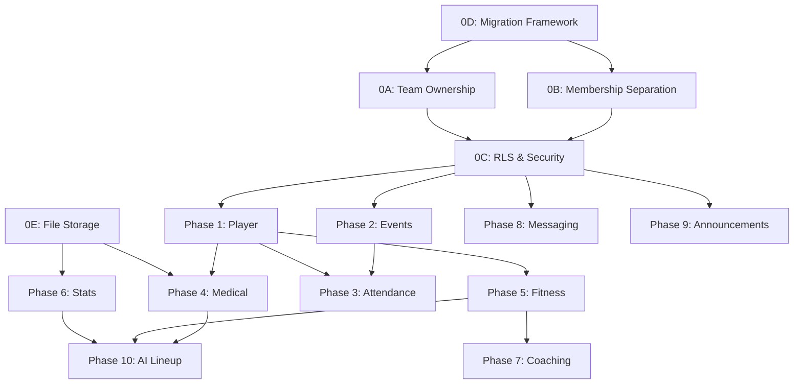

# Equipex -- Implementation Plan v3

> Resolves all contradictions from v2 review. All decisions are now final -- no open either/or choices remain.

---

## Authority Matrix

| Data Domain | Admin | Manager | BasketballCoach | FitnessCoach | Doctor | Analyst | Player |
|---|---|---|---|---|---|---|---|
| User Accounts | W (any role) | W (except Manager) | -- | -- | -- | -- | -- |
| Teams | W (any) | W (own) | -- | -- | -- | -- | -- |
| Team Members | W (add/remove) | W (own teams) | -- | -- | -- | -- | -- |
| Player Profile | W | W (own teams) | -- | W (own teams) | -- | -- | R (own) |
| Events/Calendar | W (any) | W (own teams) | R | R | R | R | R (own team) |
| Attendance | W (any) | W (own teams) | -- | -- | -- | -- | R (own) |
| Medical Records | R | R (own teams) | R (own team) | R (own team) | W (own team) | R (own team) | R (own only) |
| Fitness Records | R | R (own teams) | R (own team) | W (own team) | R (own team) | R (own team) | R (own only) |
| Game Stats | R | R (own teams) | R (own team) | R (own team) | -- | W (own team) | R (own + team agg) |
| Coaching Plans | R | R (own teams) | W (own plans) | W (own plans) | -- | R (own team) | R (team plans) |
| AI Lineup | R | R (own teams) | W (view/create) | -- | -- | -- | -- |
| Messages | -- | -- | W (own) | W (own) | W (own) | W (own) | W (own) |
| Announcements | W (any) | W (own teams) | R | R | R | R | R |
| Clearance toggle | -- | -- | -- | -- | W | -- | R (own) |

---

## Onboarding & Team Membership (Final, No Contradictions)

### Single Source of Truth: How Users Enter the System

**Step 1 -- Platform Admission** (always required):
- User signs up -> [UserApprovalRequest](file:///C:/Users/Mega%20Store/.gemini/antigravity/scratch/SportsPlatform.Auth/SportsPlatform.Auth.Core/Entities/UserApprovalRequest.cs#5-21) created (Pending)
- Manager/Admin reviews -> marks Approved or Rejected
- This ONLY controls login access. No team. No role. Just "can this person use the platform."

**Step 2 -- Team Assignment** (always a separate action, but can happen in the same API call):
- A reusable internal method: `AssignUserToTeam(userId, roleName, teamId, assignedBy)`
- This creates the [UserRole](file:///C:/Users/Mega%20Store/.gemini/antigravity/scratch/SportsPlatform.Auth/SportsPlatform.Auth.Core/Entities/UserRole.cs#5-21) record (team-scoped, Approved)
- For Players: also creates `PlayerTeam` record, enforces single-team rule

**The convenience shortcut**: When a Manager calls `POST /approval/{id}/approve` with `RoleName + TeamId`, the API internally does Step 1 + Step 2 atomically. But they are two distinct operations in the service layer.

### Four Ways to Get on a Team

| Method | Who initiates | Who approves | Creates |
|---|---|---|---|
| **During onboarding** | Manager (via approval endpoint) | N/A (immediate) | [UserRole](file:///C:/Users/Mega%20Store/.gemini/antigravity/scratch/SportsPlatform.Auth/SportsPlatform.Auth.Core/Entities/UserRole.cs#5-21) |
| **Team join request** | Active user | Target team's Manager | `TeamJoinRequest` -> [UserRole](file:///C:/Users/Mega%20Store/.gemini/antigravity/scratch/SportsPlatform.Auth/SportsPlatform.Auth.Core/Entities/UserRole.cs#5-21) |
| **Manager invitation** | Manager | Target user accepts | `TeamInvitation` -> [UserRole](file:///C:/Users/Mega%20Store/.gemini/antigravity/scratch/SportsPlatform.Auth/SportsPlatform.Auth.Core/Entities/UserRole.cs#5-21) |
| **Direct add** | Manager/Admin | N/A (immediate) | [UserRole](file:///C:/Users/Mega%20Store/.gemini/antigravity/scratch/SportsPlatform.Auth/SportsPlatform.Auth.Core/Entities/UserRole.cs#5-21) |

**Player special rule**: Joining a new team auto-removes from old team.

---

## Auth & Security Model (Final Decisions)

### Token Claims = Single Source of Truth

> [!IMPORTANT]
> JWT token claims are authoritative for API-layer authorization AND RLS session variables. RLS functions do NOT query the database for role checks -- they read session vars set by middleware.

| Layer | Authority | How |
|---|---|---|
| **API authorization** | JWT claims | `[Authorize(Roles = "Manager,Admin")]`, `ClaimTypes.Role` |
| **RLS session** | JWT claims (via middleware) | [RlsMiddleware](file:///C:/Users/Mega%20Store/.gemini/antigravity/scratch/SportsPlatform.Auth/SportsPlatform.Auth.Api/Middleware/RlsMiddleware.cs#7-48) sets `app.user_id` and `app.user_roles` from token |
| **RLS policies** | Session vars | SQL functions read `app.user_id`, `app.user_roles` -- never query `user_role` table |

### RLS Helper Functions (Current-User Centric)

All helpers operate on `current_app_user_id()` -- no user_id parameter.

```sql
-- Is the current session user an admin?
CREATE OR REPLACE FUNCTION is_admin() RETURNS boolean AS $$
  SELECT current_setting('app.user_roles', true) LIKE '%Admin%';
$$ LANGUAGE sql STABLE;

-- Is the current session user a manager of the given team?
CREATE OR REPLACE FUNCTION is_current_user_team_manager(p_team_id uuid) RETURNS boolean AS $$
  SELECT EXISTS (
    SELECT 1 FROM team_manager
    WHERE team_id = p_team_id
      AND user_id = current_app_user_id()
  );
$$ LANGUAGE sql STABLE;

-- Is the current session user a member of the given team (any approved role)?
CREATE OR REPLACE FUNCTION is_current_user_team_member(p_team_id uuid) RETURNS boolean AS $$
  SELECT EXISTS (
    SELECT 1 FROM user_role
    WHERE team_id = p_team_id
      AND user_id = current_app_user_id()
      AND status = 'Approved'
  );
$$ LANGUAGE sql STABLE;
```

### RLS Middleware Fix

Change `app.user_roles` from comma-joined string to bracketed format to avoid substring collisions:

```csharp
// Current (fragile): "Admin,Manager"
// Fixed: "|Admin|Manager|"
var roles = "|" + string.Join('|', context.User.FindAll(ClaimTypes.Role).Select(c => c.Value)) + "|";
```

Then `is_admin()` becomes: `current_setting('app.user_roles', true) LIKE '%|Admin|%'`

---

## Migration Strategy (Final -- No Either/Or)

| What | Tool | Naming Convention |
|---|---|---|
| **Entity tables, columns, indexes** | EF Core Migrations | `dotnet ef migrations add <Name>` |
| **RLS policies, functions, triggers, views, enum changes** | Numbered SQL scripts | `scripts/migrations/NNN_description.sql` |
| **Backfill / data transforms** | Numbered SQL scripts | Same folder, `NNN_backfill_description.sql` |

**Execution order**: EF migrations run first (via `db.Database.MigrateAsync()`), then SQL scripts run in order (startup runner checks `_applied_sql_migrations` tracking table).

**Rollback**: Each `NNN_up.sql` has a `NNN_down.sql`. EF migrations have built-in rollback.

**Remove** the raw SQL block from [Program.cs](file:///C:/Users/Mega%20Store/.gemini/antigravity/scratch/SportsPlatform.Auth/SportsPlatform.Auth.Api/Program.cs) (line 93-164) and replace with this framework.

---

## Phase 0 -- Foundation (5 Epics)

### Epic 0A: Team Ownership Model

**New table**: `team_manager(team_id UUID FK, user_id UUID FK, assigned_at, assigned_by, PK(team_id, user_id))`

**Backfill**: `INSERT INTO team_manager SELECT team_id, manager_user_id, NOW(), manager_user_id FROM team WHERE manager_user_id IS NOT NULL`

**Then drop**: `team.manager_user_id` column

**Code changes**: [Team.cs](file:///C:/Users/Mega%20Store/.gemini/antigravity/scratch/SportsPlatform.Auth/SportsPlatform.Auth.Core/Entities/Team.cs) (remove `ManagerUserId`, add `ICollection<TeamManager>`), `TeamManager.cs` (new entity), [TeamService.cs](file:///C:/Users/Mega%20Store/.gemini/antigravity/scratch/SportsPlatform.Auth/SportsPlatform.Auth.Core/Interfaces/ITeamService.cs) (replace all 6 instances of `ManagerUserId` checks with `TeamManager` queries), [ApprovalService.cs](file:///C:/Users/Mega%20Store/.gemini/antigravity/scratch/SportsPlatform.Auth/SportsPlatform.Auth.Core/Interfaces/IApprovalService.cs) (same), [TeamDto.cs](file:///C:/Users/Mega%20Store/.gemini/antigravity/scratch/SportsPlatform.Auth/SportsPlatform.Auth.Core/DTOs/Response/TeamDto.cs) (list of managers), all RLS policies.

**Effort: L (3-5 days)**

---

### Epic 0B: Identity vs Membership Separation

Refactor `ApprovalService.ApproveAsync`:
1. Mark `UserApprovalRequest.Status = Approved` (platform admission)
2. Call `AssignUserToTeam()` if `RoleName + TeamId` provided (team assignment)
3. These are two distinct service methods. The controller orchestrates both in one call.

New entities:
- `TeamJoinRequest`: id, user_id, team_id, requested_role, status, notes, reviewed_by, reviewed_at, created_at
- `TeamInvitation`: id, team_id, invited_user_id, role, invited_by, status, created_at

**Effort: L (3-5 days)**

---

### Epic 0C: RLS & Security Foundations

1. Fix [RlsMiddleware](file:///C:/Users/Mega%20Store/.gemini/antigravity/scratch/SportsPlatform.Auth/SportsPlatform.Auth.Api/Middleware/RlsMiddleware.cs#7-48) role format (pipe-delimited)
2. Create SQL helpers: `is_admin()`, `is_current_user_team_manager(team_id)`, `is_current_user_team_member(team_id)`
3. Rebuild team + coaching_plan policies using new helpers
4. Test with multiple role combinations

**Effort: M (1-2 days)**

---

### Epic 0D: Migration Framework

1. Remove raw SQL from [Program.cs](file:///C:/Users/Mega%20Store/.gemini/antigravity/scratch/SportsPlatform.Auth/SportsPlatform.Auth.Api/Program.cs)
2. Set up EF migrations for entities
3. Create `scripts/migrations/` folder with numbered SQL scripts
4. Create startup runner with `_applied_sql_migrations` tracking table
5. Write `001_team_manager.sql`, `002_rls_helpers.sql`

**Effort: M (1-2 days)**

---

### Epic 0E: File Storage Abstraction

`IFileStorageService` interface with `S3FileStorageService` (prod) and `LocalFileStorageService` (dev).

**No generic upload endpoint.** Uploads happen through contextual endpoints only:
- `POST /player/me/medical/{requestId}/upload` (Player uploads medical doc)
- `POST /teams/{teamId}/stats/import` (Analyst uploads stats sheet)
- `POST /teams/{teamId}/plans/{planId}/attachments` (Coach attaches to plan)

Each contextual endpoint validates `entity_type` + authorization before writing.

**Effort: M (1-2 days)**

---

## Phase 1 -- Player Module

| # | Task | Effort |
|---|---|---|
| 1.1 | `PlayerProfile` + `PlayerTeam` entities + EF config | S |
| 1.2 | `PlayerController` -- own profile, stats, fitness, medical, schedule (all read-only) | M |
| 1.3 | Team roster view (all players + staff on current team) | S |
| 1.4 | Team stats view (team aggregates only, no individual teammate stats) | S |
| 1.5 | Manager/FitnessCoach creates player profile | S |
| 1.6 | Player RLS policies using `is_current_user_team_member()` | M |

---

## Phase 2 -- Events & Calendar

| # | Task | Effort |
|---|---|---|
| 2.1 | `Event` entity + `recurrence_rule`, `recurrence_end_date`, `timezone` columns | S |
| 2.2 | `EventException` entity (original_date, new_date, is_cancelled) | S |
| 2.3 | RRULE expansion service (generate instances for date range, apply exceptions) | XL |
| 2.4 | `Match` entity linked to Match-type events | S |
| 2.5 | `EventController` -- CRUD + cancel-instance + reschedule-instance | M |
| 2.6 | Authorization (Manager/Admin write, all team members read) | S |

**Event design details:**
- Times stored in UTC, display timezone in `event.timezone` (IANA format, e.g., `Africa/Cairo`)
- `recurrence_end_date`: NULL = runs until season end (looked up from `season.end_date`)
- Exceptions identified by `event_id + original_date`
- Non-recurring events: `recurrence_rule` is NULL, one instance only

**Phase effort: XL (5-8 days)**

---

## Phase 3 -- Attendance

| # | Task | Effort |
|---|---|---|
| 3.1 | `Attendance` entity + EF config | S |
| 3.2 | `AttendanceService` -- record, bulk update, show `is_cleared` context | M |
| 3.3 | `AttendanceController` -- Manager/Admin write, player reads own | S |

**Attendance schema for recurring events:**

```
attendance:
  id UUID PK
  event_id UUID FK -> event
  instance_date DATE NOT NULL        -- [ADDED] which instance of the recurring event
  player_id UUID FK -> player_profile
  status attendance_status
  recorded_by_staff_id UUID FK
  recorded_at TIMESTAMPTZ
  notes TEXT
  UNIQUE(event_id, instance_date, player_id)
```

For non-recurring events, `instance_date` = the event date. For recurring events, `instance_date` = the specific occurrence date from RRULE expansion.

---

## Phase 4 -- Medical Records (Depends on 0E)

| # | Task | Effort |
|---|---|---|
| 4.1 | `MedicalRecord` entity | S |
| 4.2 | `MedicalDocRequest` entity (Doctor requests doc from Player) | S |
| 4.3 | `MedicalService` -- Doctor CRUD, clearance toggle, doc review workflow | L |
| 4.4 | `MedicalController` -- Doctor endpoints + Player upload via contextual endpoint | M |
| 4.5 | Visibility: team members see team records, Player sees only own | S |

---

## Phase 5 -- Fitness Records

| # | Task | Effort |
|---|---|---|
| 5.1 | `FitnessRecord` entity | S |
| 5.2 | `FitnessService` -- FitnessCoach CRUD, others read-only, player own-only | M |
| 5.3 | `FitnessController` | S |

---

## Phase 6 -- Game Statistics (Depends on 0E)

| # | Task | Effort |
|---|---|---|
| 6.1 | `PlayerGameStats` + `TeamGameStats` entities | S |
| 6.2 | Stats import -- PDF/Excel parsing via contextual upload endpoint | XL |
| 6.3 | `StatsService` -- Analyst CRUD + manual entry, trigger materialized view refresh | M |
| 6.4 | `AnalyticsService` -- query cumulative views | S |
| 6.5 | Controllers | M |
| 6.6 | Player visibility: own stats + team aggregates only | S |

---

## Phase 7 -- Coaching Plans

| # | Task | Effort |
|---|---|---|
| 7.1 | `CoachingPlan` + `TrainingSession` entities | S |
| 7.2 | `CoachingService` -- private + team-visible plans | M |
| 7.3 | Controller + updated RLS | S |

---

## Phase 8 -- Messaging (SignalR)

| # | Task | Effort |
|---|---|---|
| 8.1 | Conversation/Message/Read entities | S |
| 8.2 | `ChatHub` -- real-time delivery, typing, read receipts | XL |
| 8.3 | `MessagingService` | M |
| 8.4 | REST fallback controller | M |
| 8.5 | Redis backplane for multi-instance | M |

---

## Phase 9 -- Announcements

| # | Task | Effort |
|---|---|---|
| 9.1 | Entities + Service + Controller | M |

---

## Phase 10 -- AI Lineup

| # | Task | Effort |
|---|---|---|
| 10.1 | `AiLineupSuggestion` + `LineupPlayer` entities | S |
| 10.2 | `LineupService` -- Coach manual + AI-generated lineups | XL |
| 10.3 | Controller (Coach-only) | M |

---

## Phase 11 -- Cross-Cutting

| # | Task | Effort |
|---|---|---|
| 11.1 | Serilog structured logging | S |
| 11.2 | Rate limiting | S |
| 11.3 | CORS | S |
| 11.4 | Docker + docker-compose (API + PostgreSQL + Redis) | M |
| 11.5 | Swagger with auth headers | S |
| 11.6 | CI/CD pipeline | M |

---

## Testing Strategy

| Layer | Tool | Tests |
|---|---|---|
| **Unit** | xUnit + Moq | Pure business rules: date validation, role checks, RRULE expansion |
| **Integration** | xUnit + Testcontainers (PostgreSQL) | Service -> EF Core -> real DB. Validates enums, triggers, CHECK constraints |
| **RLS** | xUnit + Testcontainers | Set different `app.user_id`/`app.user_roles`, verify row isolation |
| **API** | xUnit + WebApplicationFactory | Full HTTP pipeline: middleware, auth, serialization |
| **SignalR** | xUnit + HubConnection client | Real-time delivery, connection auth |

---

## Dependency Graph



## Effort Legend

- **S** = Small (< 1 day)
- **M** = Medium (1-2 days)
- **L** = Large (3-5 days)
- **XL** = Epic (5-8 days)
