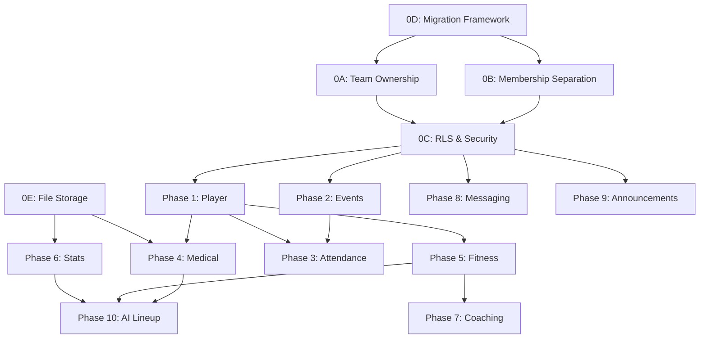

# Equipex -- Implementation Plan v4 (Final)

> Final implementation plan. Two open product decisions are explicitly marked in the Open Decisions section.

---

## Open Decisions

> [!WARNING]
> These are **unresolved product decisions**. They must be finalized before the related phase begins. Everything else in this plan is a finalized engineering or business decision.

| ID | Decision | Provisional Choice | Blocked Phase |
|---|---|---|---|
| **OD-1** | Should managers see ALL pending approval requests, or only those from users who selected their team? | Show all (Manager picks team during approval) | Phase 0B |
| **OD-2** | Player clearance: Doctor-only manual toggle, or auto-clear when expected_return passes? | Doctor-only manual toggle | Phase 4 |

---

## Authority Matrix

| Data Domain | Admin | Manager | BasketballCoach | FitnessCoach | Doctor | Analyst | Player |
|---|---|---|---|---|---|---|---|
| User Accounts | W (any role) | W (except Manager) | -- | -- | -- | -- | -- |
| Teams | W (any) | W (own) | -- | -- | -- | -- | -- |
| Team Members | W (add/remove) | W (own teams) | -- | -- | -- | -- | -- |
| Player Profile | W | W (own teams) | -- | W (own teams) | -- | -- | R (own) |
| Events/Calendar | W (any) | W (own teams) | R | R | R | R | R (own team) |
| Attendance | W (any) | W (own teams) | -- | -- | -- | -- | R (own) |
| Medical Records | R | R (own teams) | R (own team) | R (own team) | W (own team) | R (own team) | R (own only) |
| Fitness Records | R | R (own teams) | R (own team) | W (own team) | R (own team) | R (own team) | R (own only) |
| Game Stats | R | R (own teams) | R (own team) | R (own team) | -- | W (own team) | R (own + team agg) |
| Coaching Plans | R | R (own teams) | W (own plans) | W (own plans) | -- | R (team-visible) | R (team-visible) |
| AI Lineup | R | R (own teams) | W (view/create) | -- | -- | -- | -- |
| Messages | -- | -- | W (own) | W (own) | W (own) | W (own) | W (own) |
| Announcements | W (any) | W (own teams) | R | R | R | R | R |
| Clearance toggle | -- | -- | -- | -- | W | -- | R (own) |

### Staff vs Player Stats Visibility

> [!NOTE]
> **Staff** (Coach, FitnessCoach, Analyst, Doctor, Manager) on a team can view **individual player-level stats** for every player on that team, plus team aggregates.
>
> **Players** can only view **their own individual stats** plus **team-level aggregates**. They **cannot** view individual teammate stats.

### Medical Visibility -- Intentional Business Rule

> [!IMPORTANT]
> **By explicit business decision**: all team members (staff) on the same team can view medical records of players on that team. Players can only view their own medical records. This is broader than typical medical privacy defaults. This rule was confirmed in Q&A (question #20) and must not be narrowed by implementers without product approval.

---

## Coaching Plan Visibility (3 Tiers)

| Tier | Who can see | Created by | Use case |
|---|---|---|---|
| **Private draft** | Only the creator (coach/fitness coach) | Coach or FitnessCoach | Work-in-progress plans not ready for the team |
| **Team-visible** | All staff on the team + Manager | Coach or FitnessCoach (marks as "published") | Published plans visible to the coaching staff |
| **Player-assigned** | All of the above + Players on the team | Coach or FitnessCoach (marks as "assigned to team") | Plans the players need to follow |

A `coaching_plan.visibility` enum column: `Draft`, `TeamVisible`, `PlayerAssigned`.

Players see only plans marked `PlayerAssigned`. Staff see `TeamVisible` + `PlayerAssigned`. Creator sees all their own plans including `Draft`.

---

## Onboarding & Team Membership

### How Users Enter the System

**Step 1 -- Platform Admission**:
- User signs up -> [UserApprovalRequest](file:///C:/Users/Mega%20Store/.gemini/antigravity/scratch/SportsPlatform.Auth/SportsPlatform.Auth.Core/Entities/UserApprovalRequest.cs#5-21) created (Pending)
- Manager/Admin reviews -> marks Approved or Rejected
- This ONLY controls login access. No team, no role.

**Step 2 -- Team Assignment** (separate action):
- Reusable method: `AssignUserToTeam(userId, roleName, teamId, assignedBy)`
- Creates [UserRole](file:///C:/Users/Mega%20Store/.gemini/antigravity/scratch/SportsPlatform.Auth/SportsPlatform.Auth.Core/Entities/UserRole.cs#5-21) (team-scoped, Approved). For Players: also creates `PlayerTeam`.

**Convenience shortcut**: `POST /approval/{id}/approve` with `RoleName + TeamId` does Step 1 + Step 2 in **one database transaction**. Partial failures are impossible -- either both succeed or both roll back.

> [!CAUTION]
> **Transaction requirement**: the combined approval+assignment path MUST use a single DB transaction. Without this, a crash between Step 1 and Step 2 creates a platform-approved but team-unassigned user. Player single-team uniqueness also requires transactional enforcement during reassignment.

### Four Ways to Get on a Team

| Method | Initiator | Approver | Creates |
|---|---|---|---|
| During onboarding | Manager (approval endpoint) | N/A (immediate, same txn) | [UserRole](file:///C:/Users/Mega%20Store/.gemini/antigravity/scratch/SportsPlatform.Auth/SportsPlatform.Auth.Core/Entities/UserRole.cs#5-21) |
| Team join request | Active user | Target Manager | `TeamJoinRequest` -> [UserRole](file:///C:/Users/Mega%20Store/.gemini/antigravity/scratch/SportsPlatform.Auth/SportsPlatform.Auth.Core/Entities/UserRole.cs#5-21) |
| Manager invitation | Manager | Target user accepts | `TeamInvitation` -> [UserRole](file:///C:/Users/Mega%20Store/.gemini/antigravity/scratch/SportsPlatform.Auth/SportsPlatform.Auth.Core/Entities/UserRole.cs#5-21) |
| Direct add | Manager/Admin | N/A (immediate) | [UserRole](file:///C:/Users/Mega%20Store/.gemini/antigravity/scratch/SportsPlatform.Auth/SportsPlatform.Auth.Core/Entities/UserRole.cs#5-21) |

Player special rule: joining new team auto-removes from old team (in same transaction).

---

## Auth & Security Model

### Token Claims = Authority for API + RLS

| Layer | Source | Mechanism |
|---|---|---|
| API auth | JWT claims | `[Authorize(Roles)]`, `ClaimTypes.Role` |
| RLS session | JWT claims via middleware | [RlsMiddleware](file:///C:/Users/Mega%20Store/.gemini/antigravity/scratch/SportsPlatform.Auth/SportsPlatform.Auth.Api/Middleware/RlsMiddleware.cs#7-48) sets `app.user_id`, `app.user_roles` |
| RLS policies | Session vars only | SQL functions read session vars, **never query DB** |

### Token Revocation Policy

> [!WARNING]
> Since JWT claims are authoritative, role/team changes don't take effect until old tokens expire. Mitigations:

| Control | Value |
|---|---|
| **Access token TTL** | 5 minutes |
| **Refresh token TTL** | 7 days |
| **On privilege change** (role add/remove, team remove, manager revocation): | Revoke all refresh tokens for the affected user. They must re-login to get new claims. |
| **Implementation**: | `RevokeAllUserTokensAsync(userId)` called inside `AssignUserToTeam`, `RemoveUserFromTeam`, [UpdateRoleAssignment](file:///C:/Users/Mega%20Store/.gemini/antigravity/scratch/SportsPlatform.Auth/SportsPlatform.Auth.Infrastructure/Services/TeamService.cs#337-367) |

### RLS Role Encoding (Single Implementation)

**Format**: pipe-delimited with guards -- `|Admin|Manager|`

```csharp
// RlsMiddleware.cs -- ONLY implementation
var roles = "|" + string.Join("|",
    context.User.FindAll(ClaimTypes.Role).Select(c => c.Value)) + "|";
await db.Database.ExecuteSqlInterpolatedAsync(
    $"SELECT set_config('app.user_roles', {roles}, false)");
```

### RLS Helper Functions

All helpers use `current_app_user_id()` and pipe-delimited role matching:

```sql
CREATE OR REPLACE FUNCTION is_admin() RETURNS boolean AS $$
  SELECT current_setting('app.user_roles', true) LIKE '%|Admin|%';
$$ LANGUAGE sql STABLE;

CREATE OR REPLACE FUNCTION is_current_user_team_manager(p_team_id uuid)
RETURNS boolean AS $$
  SELECT EXISTS (
    SELECT 1 FROM team_manager
    WHERE team_id = p_team_id AND user_id = current_app_user_id()
  );
$$ LANGUAGE sql STABLE;

CREATE OR REPLACE FUNCTION is_current_user_team_member(p_team_id uuid)
RETURNS boolean AS $$
  SELECT EXISTS (
    SELECT 1 FROM user_role
    WHERE team_id = p_team_id
      AND user_id = current_app_user_id()
      AND status = 'Approved'
  );
$$ LANGUAGE sql STABLE;
```

---

## Migration Strategy

| What | Tool |
|---|---|
| Entity tables, columns, indexes | EF Core Migrations (`dotnet ef migrations add`) |
| RLS, functions, triggers, views, enums | Numbered SQL: `scripts/migrations/NNN_description.sql` |
| Rollback | EF: built-in. SQL: each `NNN_up.sql` has `NNN_down.sql` |

Startup: `db.Database.MigrateAsync()` first, then SQL runner checks `_applied_sql_migrations` table.

Remove the raw SQL block from [Program.cs](file:///C:/Users/Mega%20Store/.gemini/antigravity/scratch/SportsPlatform.Auth/SportsPlatform.Auth.Api/Program.cs) (lines 93-164).

---

## Phase 0 -- Foundation (5 Epics)

### Epic 0A: Team Ownership Model

**Safe migration rollout (6 steps)**:

| Step | Action | Reversible? |
|---|---|---|
| 1 | Create `team_manager` junction table | Yes (drop table) |
| 2 | Backfill from `team.manager_user_id` | Yes (truncate) |
| 3 | **Dual-read**: update queries to check `team_manager` first, fall back to `manager_user_id` | Yes (remove fallback) |
| 4 | **Switch writes**: new manager assignments write to `team_manager` only | Yes (revert code) |
| 5 | Rebuild RLS policies + dependent services to use only `team_manager` | Harder to revert |
| 6 | Drop `team.manager_user_id` column (last step, after validation) | No |

**Code changes**: [Team.cs](file:///C:/Users/Mega%20Store/.gemini/antigravity/scratch/SportsPlatform.Auth/SportsPlatform.Auth.Core/Entities/Team.cs), `TeamManager.cs` [NEW], [TeamService.cs](file:///C:/Users/Mega%20Store/.gemini/antigravity/scratch/SportsPlatform.Auth/SportsPlatform.Auth.Core/Interfaces/ITeamService.cs) (6 locations), [ApprovalService.cs](file:///C:/Users/Mega%20Store/.gemini/antigravity/scratch/SportsPlatform.Auth/SportsPlatform.Auth.Core/Interfaces/IApprovalService.cs), [TeamDto.cs](file:///C:/Users/Mega%20Store/.gemini/antigravity/scratch/SportsPlatform.Auth/SportsPlatform.Auth.Core/DTOs/Response/TeamDto.cs), all RLS policies.

**Effort: L (3-5 days)**

---

### Epic 0B: Identity vs Membership Separation

- Split [ApproveAsync](file:///C:/Users/Mega%20Store/.gemini/antigravity/scratch/SportsPlatform.Auth/SportsPlatform.Auth.Infrastructure/Services/ApprovalService.cs#39-161) into platform-approve + team-assign (two methods, one transaction)
- New `AssignUserToTeam()` reusable method (also calls `RevokeAllUserTokensAsync`)
- New entities: `TeamJoinRequest`, `TeamInvitation`
- New controller: `MembershipController`

**Effort: L (3-5 days)**

---

### Epic 0C: RLS & Security Foundations

- Fix [RlsMiddleware](file:///C:/Users/Mega%20Store/.gemini/antigravity/scratch/SportsPlatform.Auth/SportsPlatform.Auth.Api/Middleware/RlsMiddleware.cs#7-48) to pipe-delimited format
- Create 3 SQL helpers
- Rebuild team + coaching_plan + player policies
- Test with multiple role combos against real PostgreSQL

**Effort: M (1-2 days)**

---

### Epic 0D: Migration Framework

- Remove raw SQL from [Program.cs](file:///C:/Users/Mega%20Store/.gemini/antigravity/scratch/SportsPlatform.Auth/SportsPlatform.Auth.Api/Program.cs)
- EF migrations for entities + `_applied_sql_migrations` runner for SQL
- First scripts: `001_team_manager.sql`, `002_rls_helpers.sql`

**Effort: M (1-2 days)**

---

### Epic 0E: File Storage Abstraction

- `IFileStorageService` (S3 prod, local dev)
- **No generic upload endpoint** -- uploads via contextual endpoints only:
  - `POST /player/me/medical/{requestId}/upload`
  - `POST /teams/{teamId}/stats/import`
  - `POST /teams/{teamId}/plans/{planId}/attachments`

**Effort: M (1-2 days)**

---

## Phase 1 -- Player Module

| Task | Effort |
|---|---|
| `PlayerProfile` + `PlayerTeam` entities | S |
| `PlayerController` (own profile/stats/fitness/medical/schedule, read-only) | M |
| Team roster view, team aggregate stats view | S |
| Manager/FitnessCoach creates player profile | S |
| Player RLS using `is_current_user_team_member()` | M |

---

## Phase 2 -- Events & Calendar

### Prerequisite: Season Entity

The DB already has a `season` table. Add `Season` entity + EF config before event work. Fields: `season_id`, `name`, `start_date`, `end_date`, `is_current` (unique partial index: only one current season).

Recurring events with `recurrence_end_date = NULL` default to `season.end_date` of the current season. If no current season exists, `recurrence_end_date` is **required**.

### Event Design (Final)

- **Recurring**: Training Sessions only. Uses RRULE format. Meetings and Matches are always one-off.
- **Timezone**: stored in UTC, display timezone in `event.timezone` (IANA, e.g. `Africa/Cairo`)
- **Recurrence end**: explicit date, or defaults to current season end
- **Exceptions**: `event_exception(event_id, original_date, new_date, is_cancelled)`

| Task | Effort |
|---|---|
| `Season` entity + EF config | S |
| `Event` entity + recurrence columns | S |
| `EventException` entity | S |
| RRULE expansion service | XL |
| `Match` entity | S |
| `EventController` (CRUD + cancel/reschedule instance) | M |

**Phase effort: XL (5-8 days)**

---

## Phase 3 -- Attendance

**Schema** (with `instance_date` for recurring events):

| Column | Type | Notes |
|---|---|---|
| id | UUID PK | |
| event_id | UUID FK | |
| **instance_date** | DATE NOT NULL | Which occurrence; equals event date for one-off events |
| player_id | UUID FK | |
| status | attendance_status | Present/Absent/Late/Injured |
| recorded_by_staff_id | UUID FK | |
| recorded_at | TIMESTAMPTZ | |
| notes | TEXT | |

**Unique**: [(event_id, instance_date, player_id)](file:///C:/Users/Mega%20Store/.gemini/antigravity/scratch/SportsPlatform.Auth/SportsPlatform.Auth.Core/Entities/Team.cs#3-16)

| Task | Effort |
|---|---|
| Entity + config | S |
| Service (bulk update, show `is_cleared`) | M |
| Controller (Manager/Admin write) | S |

---

## Phase 4 -- Medical Records (Depends on 0E)

| Task | Effort |
|---|---|
| `MedicalRecord` entity | S |
| `MedicalDocRequest` entity (Doctor -> Player) | S |
| `MedicalService` (Doctor CRUD, clearance toggle, doc workflow) | L |
| Controller (Doctor + Player contextual upload) | M |
| Visibility (staff sees team records, player sees own only) | S |

---

## Phase 5 -- Fitness Records

| Task | Effort |
|---|---|
| Entity | S |
| Service (FitnessCoach CRUD, others read) | M |
| Controller | S |

---

## Phase 6 -- Game Statistics (Depends on 0E)

| Task | Effort |
|---|---|
| `PlayerGameStats` + `TeamGameStats` entities | S |
| Stats import (PDF/Excel via contextual upload) | XL |
| `StatsService` (Analyst CRUD, materialized view refresh) | M |
| `AnalyticsService` (cumulative views) | S |
| Controllers | M |
| **Visibility**: staff sees player-level + team-level; player sees own + team aggregates only | S |

---

## Phase 7 -- Coaching Plans

| Task | Effort |
|---|---|
| Entities + `visibility` enum column (`Draft`/`TeamVisible`/`PlayerAssigned`) | S |
| Service (Coach/FitnessCoach create; visibility-based access rules) | M |
| Controller + RLS (creator sees all own; staff sees TeamVisible+; players sees PlayerAssigned only) | M |

---

## Phase 8 -- Messaging (SignalR)

| Task | Effort |
|---|---|
| Conversation/Message/Read entities | S |
| `ChatHub` (real-time, typing, read receipts) | XL |
| `MessagingService` | M |
| REST fallback | M |
| Redis backplane | M |

---

## Phase 9 -- Announcements

| Task | Effort |
|---|---|
| Entities + Service + Controller | M |

---

## Phase 10 -- AI Lineup

| Task | Effort |
|---|---|
| Entities | S |
| `LineupService` (Coach manual + AI) | XL |
| Controller (Coach-only) | M |

---

## Phase 11 -- Cross-Cutting

| Task | Effort |
|---|---|
| Serilog, rate limiting, CORS | S each |
| Docker + compose (API + PostgreSQL + Redis) | M |
| Swagger, CI/CD | S + M |

---

## Testing Strategy

| Layer | Tool | What |
|---|---|---|
| Unit | xUnit + Moq | Pure logic: RRULE, role checks, date math |
| Integration | xUnit + Testcontainers | Service -> EF -> real PostgreSQL (enums, triggers, constraints) |
| RLS | xUnit + Testcontainers | Different session vars, verify row isolation |
| API | WebApplicationFactory | HTTP pipeline, middleware, auth, serialization |
| SignalR | HubConnection client | Real-time delivery, auth |

---

## Dependency Graph



## Effort: S (<1d), M (1-2d), L (3-5d), XL (5-8d)
